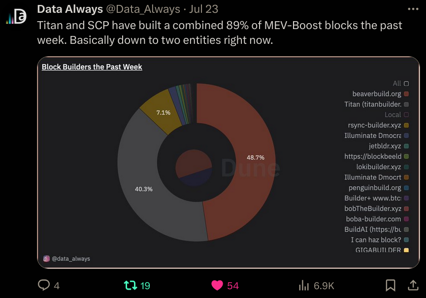
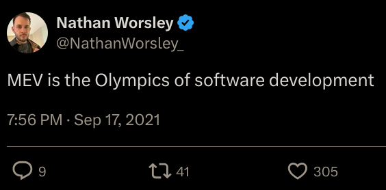
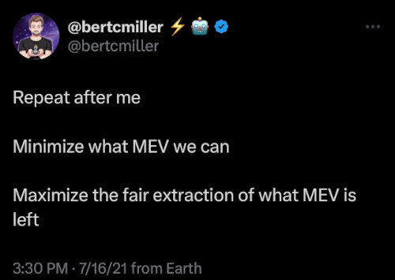

# KILL MEV

Let us count all the reasons why

## 1. Endless complexity

All of the added complexity from the infrastructure created to support MEV has made it much harder for people to use Ethereum.

Pain points include:
- where should I send my txn, so it's not exposed in the public blockchain?
  - oh wait there's a cottage industry of options, each with different features, that may or may not sell my orderflow
- competition and lack of standardization at the validator level
  - I can only buy [β-blockspace](https://docs.xga.com/) on blocks that run their validator

## 2. Increased barrier to entry

Developers have to build MEV-resistance into every single thing.

Validators have to run increasingly complex setups to stay competitive.

Home staking becomes less and less viable as MEV profits go up.

Without low barriers to entry, Ethereum falls behind on innovation.

What's a world computer if not everyone can participate?

## 3. Increased centralization

Solving is a winner-take-all game that leads to natural oligopologies, or even worse monopolies.

## 4. Waste of brainpower

The smartest people in crypto have been lured to MEV with promises of riches and the competition.

This takes time, effort, and brainpower away from actually improving Ethereum in a positive-sum way.

We should be promoting making a more useful world computer for everyone, not stealing from users.

## 5. Negative-sum game

It's literally moving money from one pocket to another. From users to MEVers.

Efforts to distribute the earnings back to users will never return all of it.

Even if they did, it's redistributing from users to stakers.

Do we want to build a world computer for everyone, or to eke out a few more basis points in staking yield?

## 6. It's amoral

Screwing someone over because you observed their transaction in the mempool shouldn't be something anyone endorses.

Sandwiching, front-running, even back-running steal money from the person executing the transaction.

## 7. It's illegal

Did you know front-running is illegal in every other market? [recent charge](https://www.sec.gov/newsroom/press-releases/2022-228), [wikipedia](https://en.wikipedia.org/wiki/Front_running)

## 8. Reject modernity

Return to the original goal of minimizing MEV wherever possible, that got swept away in an orgy of VC profits for MEV infra.

## 9. It's not fucking hard

We know [how to do it](https://ethresear.ch/t/execution-consensus-separation/19964), if we want to.

### Contribute

Contributions welcome at https://github.com/wakamex/killmev
